# Find Images.app

> **Standalone desktop application for local image search**
>
> **[Find Images.app](https://github.com/ceveyne/find-images-releases/releases)** is the standalone version of the **[find-image](https://lmstudio.ai/ceveyne/find-image)** LM Studio plugin. It gives you the same multimodal search engine — visual, text-based, and metadata-driven — without requiring LM Studio or an AI agent.

The **[app](https://github.com/ceveyne/find-images-releases/releases)** is for people who either are not particular fans of "agentic" AI or believe they make the best agent themselves anyway. Functionally there are no major differences between the **[app](https://github.com/ceveyne/find-images-releases/releases)** and the **[find-image](https://lmstudio.ai/ceveyne/find-image)**-plugin. But where the plugin lets you continue directly with results in LM Studio (e.g., using **[analyse-image](https://lmstudio.ai/ceveyne/analyse-image)** to detect objects, or **[process-image](https://lmstudio.ai/ceveyne/process-image)** / **[draw-things-chat](https://lmstudio.ai/ceveyne/draw-things-chat)** for edits), **[Find Images.app](https://github.com/ceveyne/find-images-releases/releases)** skips the agent layer and focuses on its core purpose: _finding images_.

It is designed for browsing and organizing large image collections — or unearthing forgotten visual treasures from your own archives.

## Contents

- [What It Does](#what-it-does)
  - [Search Sources](#search-sources)
- [Setup](#setup)
- [Using Find Images.app](#using-find-imagesapp)
  - [Interface Layout](#interface-layout)
  - [Searching](#searching)
  - [Result Views](#result-views)
  - [Result Details](#result-details)
  - [Structured Filters from Details](#structured-filters-from-details)
  - [Tag Management](#tag-management)
  - [Projects and Queries](#projects-and-queries)
- [Settings](#settings)
  - [General](#general)
  - [Search](#search)
  - [Indexing](#indexing)
- [Use cases](#use-cases)
- [Behind the Scenes: Fusion Embedding](#behind-the-scenes-fusion-embedding)
- [Comparing App vs Plugin](#comparing-app-vs-plugin)
- [Persistent Data](#persistent-data)
- [Staying Up to Date](#staying-up-to-date)
- [License](#license)

## What It Does

**[Find Images.app](https://github.com/ceveyne/find-images-releases/releases)** searches local image stores using a combination of metadata search and multimodal embedding search powered by [Qwen3-VL-Embedding](https://github.com/QwenLM/Qwen3-VL-Embedding).

The search is **multimodal**. This means: it doesn't just find images that are appropriately tagged or contain parts of the search query in their metadata. Searching and finding also works purely _visually_.

Natural language descriptions find images, reference images find images, tags find images, filenames find images. (And you can combine everything — use the metadata for searching, apply hard filters on structured fields, and more.)

Although our tools originated from **Draw Things** projects (.sqlite3, PNG), camera photos — including HEIC from iPhone and Apple Photos — now receive the same attention and love as generated images through EXIF metadata support.

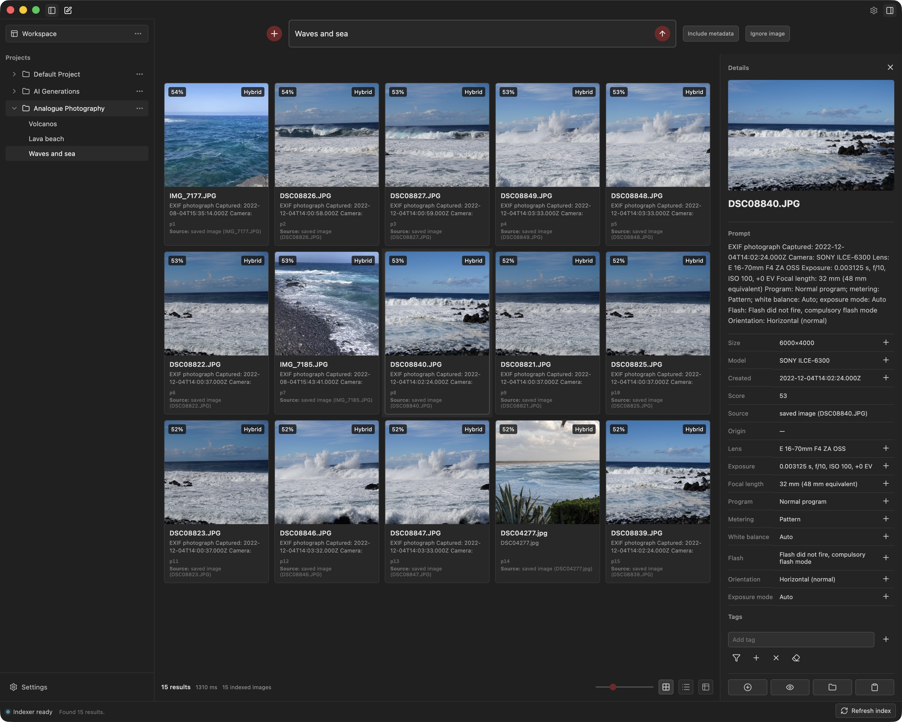

> This example shows a simple text search — which can be a great starting point. To refine your search and steer it in the desired direction, you can drag any image from the result list into the input field as a reference.

### Search Sources

The local index can include:

- **Image directories** — any folders you add containing image files
- **Apple Photos Library** — your Apple Photos Library, indexed through Apple Photos' permission-based access (optional)
- **Draw Things generations** created by draw-things-chat or process-image
- **Saved Draw Things / ComfyUI images** with PNG metadata
- **LM Studio chat attachments** with metadata sidecars (optional)
- **Images from LM Studio working directories** (optional)
- **Draw Things project files** with generation history and thumbnails
- **Plain saved images** without any metadata

The multimodal index accepts these extension-based input formats:

- **Native formats:** PNG, JPG/JPEG, HEIC, TGA, BMP, PSD, GIF, HDR, PIC, PPM, and PGM.
- **Other macOS formats:** ASTC, AVCI, AVIF, DDS, DCM, EXR, HEICS, HEIF, ICNS, ICO, JP2, JXL, KTX, MPO, PBM, PDF, PICT, PVR, SGI, SVG, TIFF, and WebP.
- **RAW formats:** 3FR, ARW, AXR, CR2, CR3, CRW, DCR, DNG, DXO, ERF, FFF, IIQ, MOS, MRW, NEF, NEFX, NRW, ORF, PEF, RAF, RAW, RW2, RWL, SR2, SRF, SRW, and TIF.

HEIC files work both from image directories and from the Apple Photos Library. RAW format support is controlled by the `RAW Images` setting.

## Setup

First launch triggers a guided onboarding wizard:

1. **Check** — the app inspects whether a search engine binary and embedding model are already installed
2. **Search engine** — point to (or download) the llama-server runtime binary
3. **Embedding model** — select or download a Qwen3-VL-Embedding GGUF model
4. **Verify** — downloaded files are integrity-checked
5. **Folders** — choose which image directories to index
6. **Index** — the app builds the local search index

💡 The app's onboarding wizard will download the model for you by default to an appropriate location.

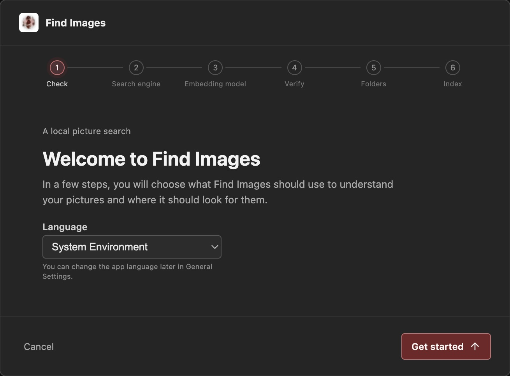

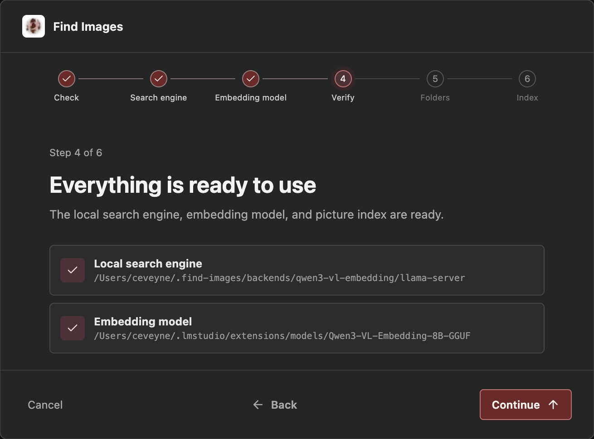

> ⚠️ Do **not** place Qwen3-VL-Embedding models in `~/.lmstudio/models`. LM Studio does not support them yet and the embedding models may interfere with regular Qwen3-VL models.

After onboarding, you can change all settings in-app at any time.

> Before things get going for real, you need to index the images you want to be able to find. On reasonably fast hardware, this rarely takes less than 1 second or more than 5 seconds per image. Start with a manageable amount for your first test. You can start and stop indexing at any time. It's normal for fans to spin up during longer indexing runs — the built-in llama-server fully utilizes the GPU.
> 💡 By default, very large images (>1k) are converted before embedding. This delivers roughly 10–15× faster indexing performance but may affect precision. If you disable `Use Previews for Image Retrieval` in `Settings`, images will be embedded at their original resolution — which takes longer and works for images up to 6k. It's worth comparing the time investment and results to find the setting that works best for you.

## Using Find Images.app

### Interface Layout

The app has a three-panel layout:

- **Left sidebar** — projects and saved queries, organized hierarchically with drag-and-drop reordering
- **Center** — search bar (with optional reference image) and results in tiles, list, or table view
- **Right sidebar** — result details panel or settings

All panels are resizable. Layout state is persisted between sessions.

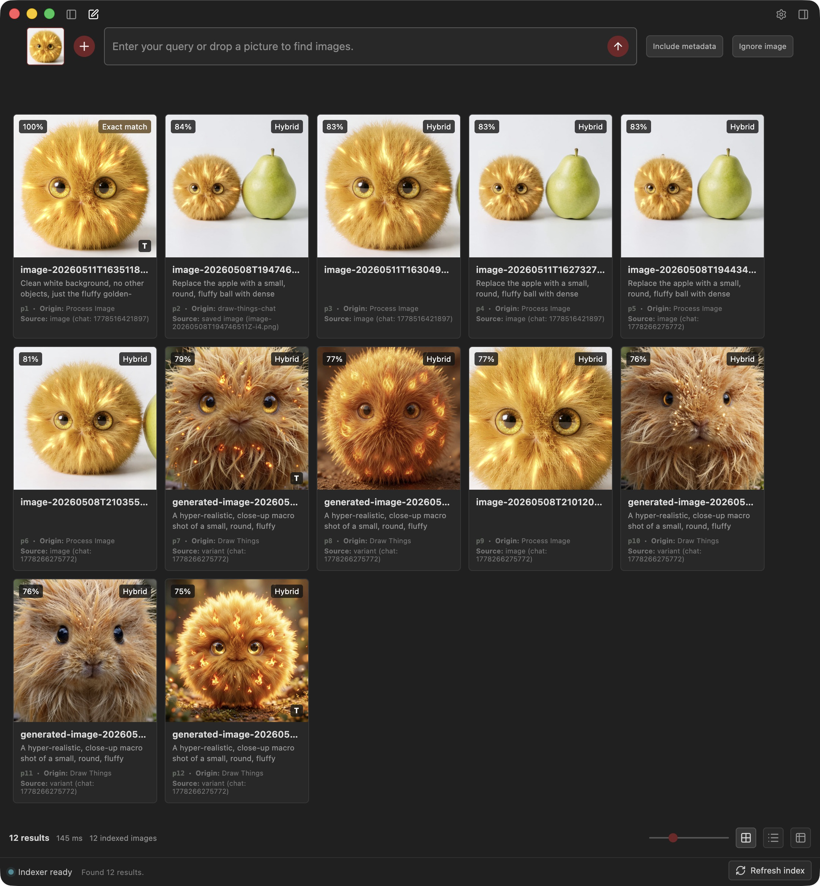

> This screenshot shows the layout with both sidebars closed.

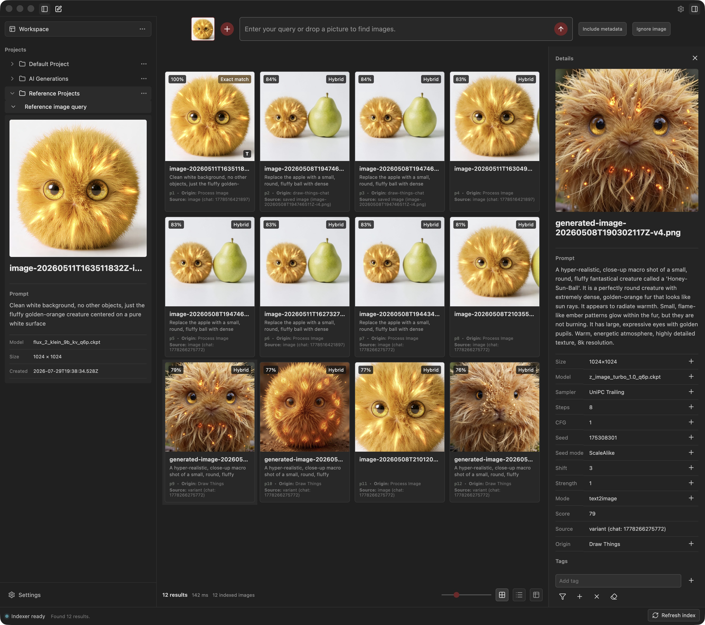

> This screenshot shows the layout with both sidebars open: on the left you see the details of the reference image, on the right the details of the selected result.

### Searching

The search bar accepts:

- **Text queries** — natural language descriptions like `golden retriever on a beach at sunset`
- **Reference images** — drag and drop an image, or use the file picker button, to find visually similar results
- **Structured filters** — hard AND filters using syntax like `Model: flux_2`, `Size: 1024x1024`, `Origin: draw-things-chat`, `Timestamp: 2026-07`

Two toggle options modify how reference images are used:

| Option               | Effect                                                                                    |
| -------------------- | ----------------------------------------------------------------------------------------- |
| **Include metadata** | Adds the reference image's generation metadata as a ranking signal across the full corpus |
| **Ignore image**     | Uses only prompt/metadata similarity, deliberately omitting visual pixels from the search |

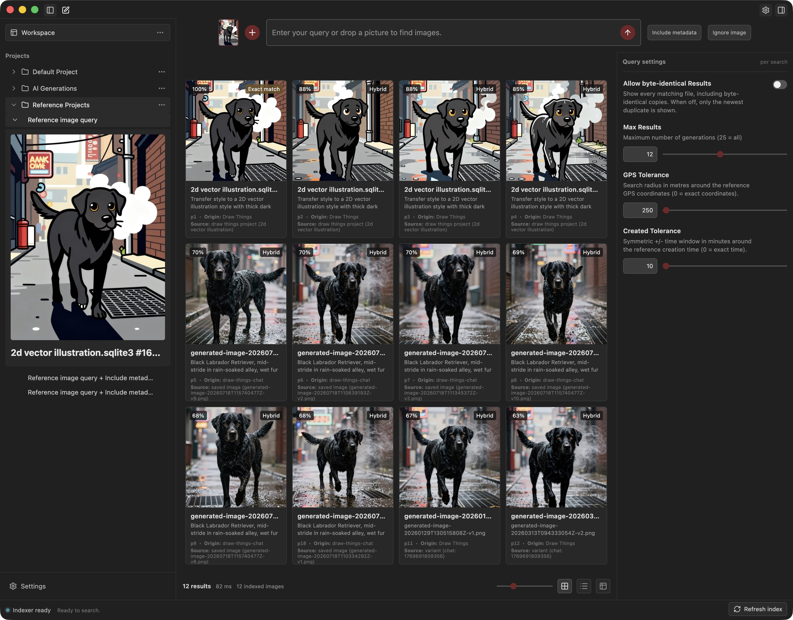

> This example nicely illustrates how result ranking is structured: the first four results are similar to the reference image both in content _and_ style. The next eight results match "only" on a thematic level.

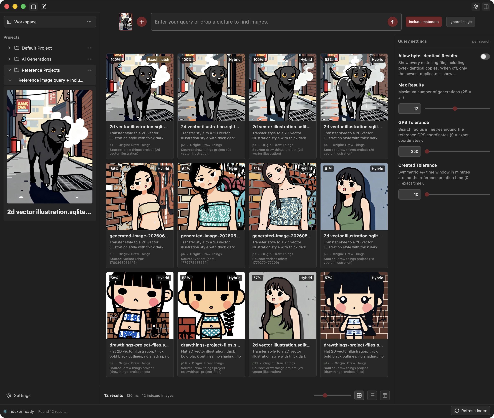

> This example shows what influence metadata has on the result list: because the prompt for the reference image describes a 2D illustration style, the photorealistic results have disappeared — all twelve images now show a "2D vector illustration style with thick dark outlines, flat colors, and a cute chibi aesthetic."

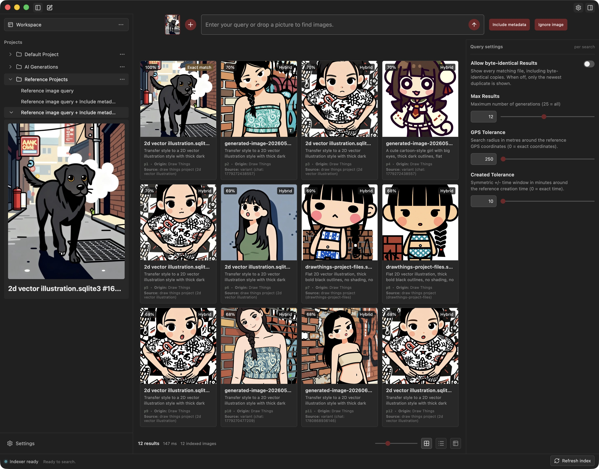

> In this third example, both `Include metadata` _and_ `Ignore image` are active. This means: only the metadata from the reference image feeds into the search — not its visual content. Result: all dogs (except the reference image itself) have been dropped from the results list — more precisely, from the top twelve positions — because the prompt describes only the style but no subject ("dog"). Visual similarity therefore has no influence; only the metadata counts.

### Result Views

Three view modes let you navigate results differently:

- **Preview size** — adjustable thumbnail dimensions in the result grid
- **Tiles** — grid of image previews with score badges and source indicators
- **List** — compact vertical list showing filename, prompt snippet, model, and date
- **Table** — sortable columns for size, model, origin, created date, match type, and score
- **Open preview** — Navigate through query results by opening a large preview with `<space>`, using arrow keys to browse the results.

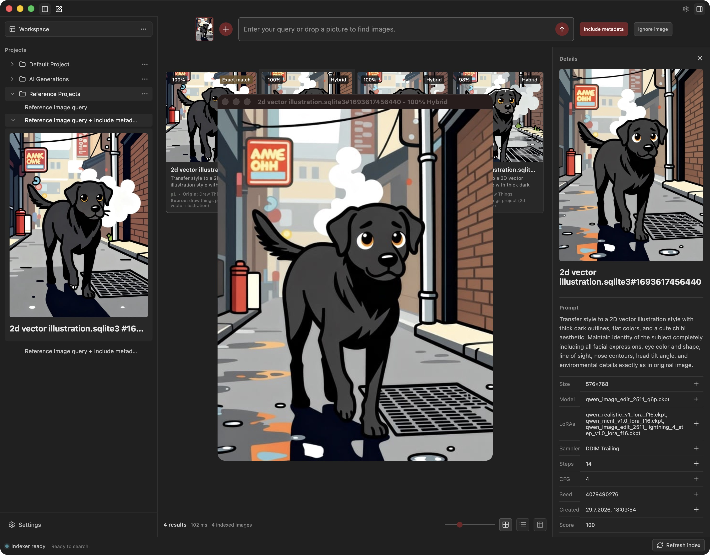

> To quickly review many results in detail, you can use the large preview mode. The easiest way is via keyboard: `<Tab>` switches between queries in the workspace and results in the center panel. `<Space>` opens the preview. Use arrow keys to navigate through the images.

### Result Details

Click any result to open the detail panel on the right. It shows:

- An image preview
- Prompt / generation parameters (size, model, LoRAs, match score, source, origin)
- EXIF camera metadata (lens, exposure, aperture, ISO, focal length, GPS, etc.)
- Existing Tags and tools to manage them and/or apply them to a query
- "Use as reference", "Open preview", "Reveal in Finder", and "Copy prompt" actions

### Structured Filters from Details

Any structured field in the detail panel can be dragged into the search bar as a "hard" filter. For example, dragging the `Model` value creates a `Model: flux_2_klein_9b_q8p.ckpt` clause that restricts results to images taken with that model.

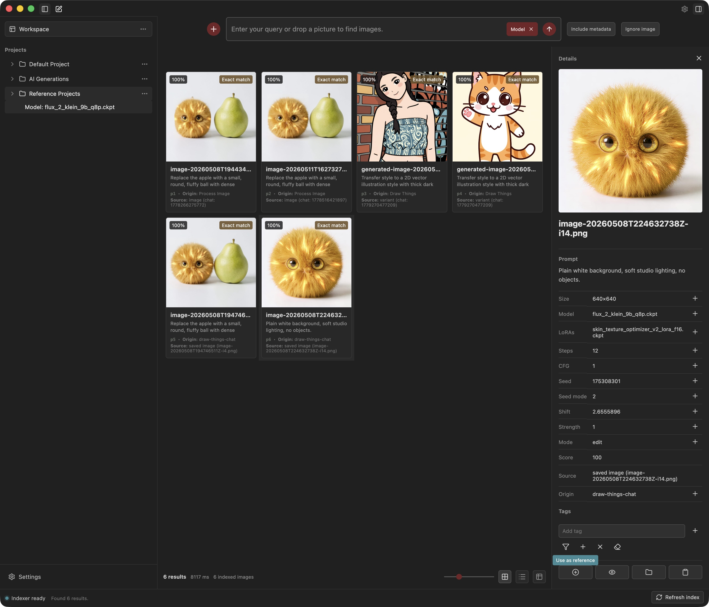

> In this example, clicking the `+` button in the detail panel turned the `Model` field into a filter — visible as the `Model` chip at the top of the query bar. This limits results to images matching that model only; all other potential matches are excluded. The remaining search functions work exactly as they would without any filter: you describe what you're looking for, use reference images, etc., but you'll only be shown results that match the `Model` criterion.

### Structured Filters from Filenames

Filenames represent a special form of filtering. This works in principle with individual image files too, but it's especially useful for Draw Things project files (sqlite3). You can use Find Images to see _all_ generated images within a single project file — and if needed, also search _within_ that specific project file.

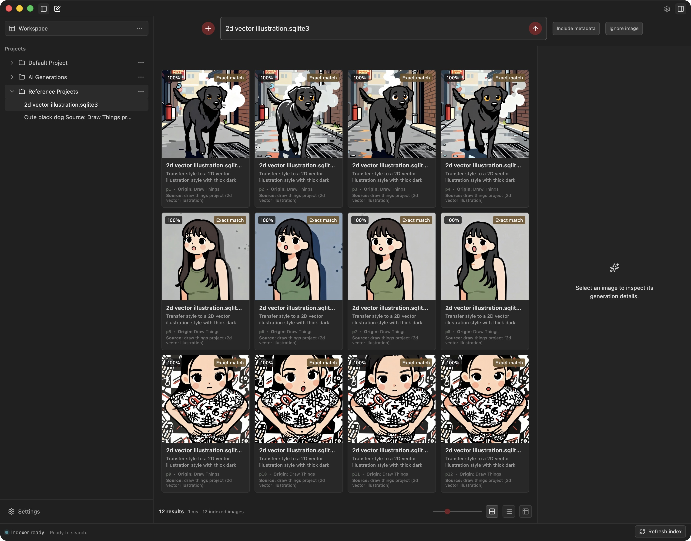

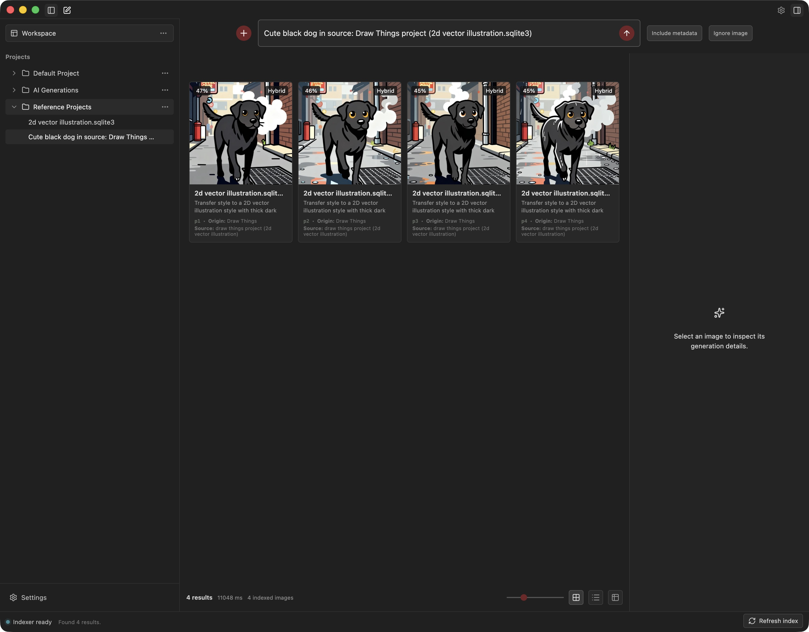

### Tag Management

Images can be tagged for organization:

- **Add / remove tags** from individual results via the detail panel
- **Drag tag sets** between results to copy tags across multiple images
- **Filter by tags** using `Tags: illustration, 2d` syntax in the query bar
- Tags persist in the index until explicitly removed

⚠️ A single tag cannot contain spaces

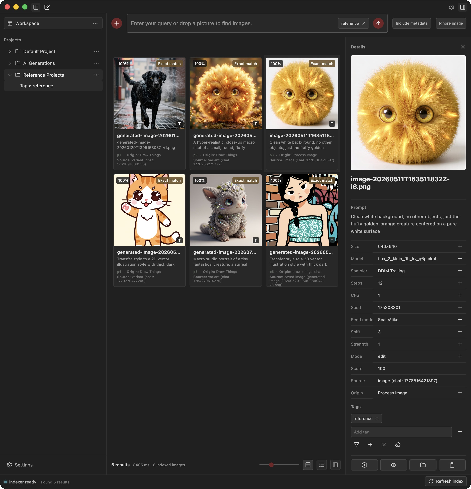

> Tags behave like the structured filters described above — except that you can freely define and assign them. This works with individual images as well as multi-image selections.

### Projects and Queries

Queries are organized into projects. Each project holds a list of saved searches with their full context (query text, reference image, filters, settings). You can:

- Create, rename, move, and delete projects
- Create, rename, move, and delete queries
- Transfer queries between projects (copy or move)
- Reorder projects and queries via drag-and-drop

## Settings

General Settings are accessible from the left sidebar. They mirror the plugin's configuration options.
Search-based Settings are accessible from the right sidebar. They are stored individually with every query.
The settings are mostly self-explanatory. Here are a few highlights:

### General

- **Embedding model path** — location of the GGUF model
- **Runtime engine path** — location of the llama-server binary
- This is the place to manage your **Image directories** — folders to scan and index.
- `Search Apple Photos Library` adds your Apple Photos Library as a search source. The next index refresh asks for Apple Photos permission, then indexes the images you have allowed the app to access. 
> The app uses the original-resolution assets from Apple Photos, which may need to be downloaded from iCloud first. This can make indexing Apple Photos slower than local files, especially when many originals are stored only in iCloud. Enabling **Photos ▸ Settings ▸ iCloud ▸ Download Originals to this Mac** can speed up later indexing runs once the originals are local. (Find Images.app app cannot change this setting for you.)
- `Search Working Directories` adds LM Studio Chat Working Directories as a search source. This is especially useful if these contain generated images from tools like **[draw-things-chat](https://lmstudio.ai/ceveyne/draw-things-chat)**.
- As a Draw **Things User** you may want to enable `Search Draw Things Projects`.
- **Projects Directory** allows you to change the default directory containing Draw Things project files.

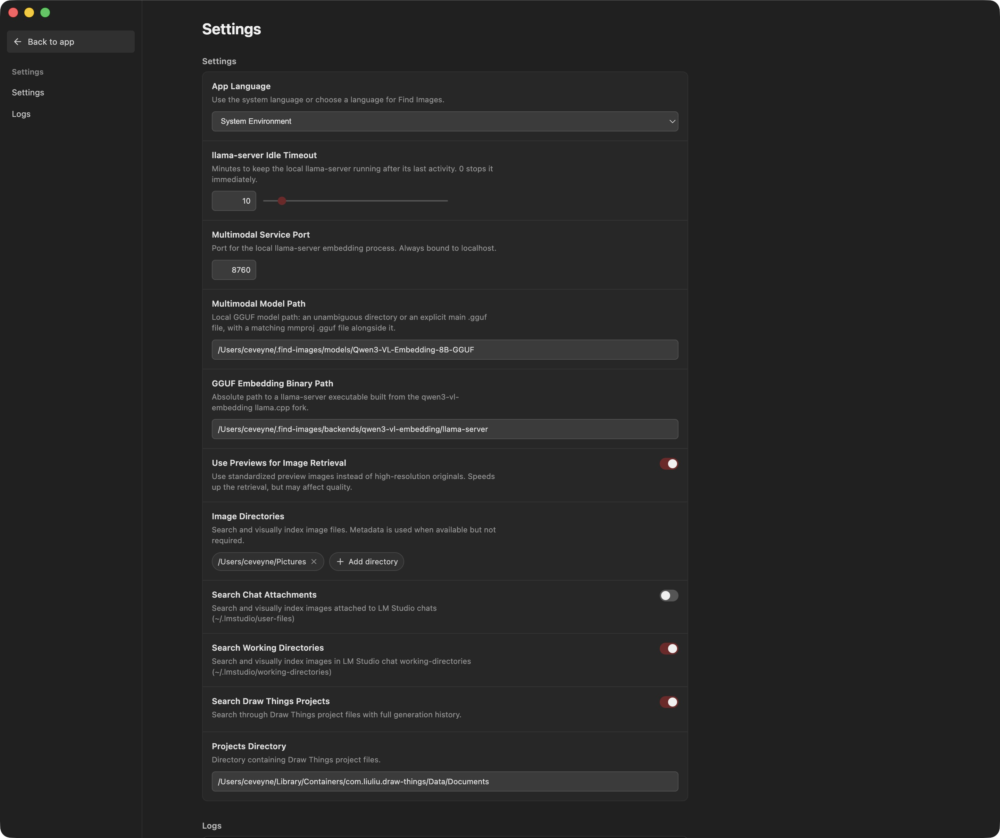

💡 To add more directories containing Draw Things project files, simply add them as **Image directories**.

### Search

- **Allow byte-identical duplicates** — show all matching files including exact copies
- **Max results** — how many results to display per query (25 = all)

💡 All settings in this section are saved per query. `New query` resets all these to the default values. To store and re-use your personal default settings, simply copy or rename your favourite queries in your project and click on it to restore all its settings instead of clicking `New query`.

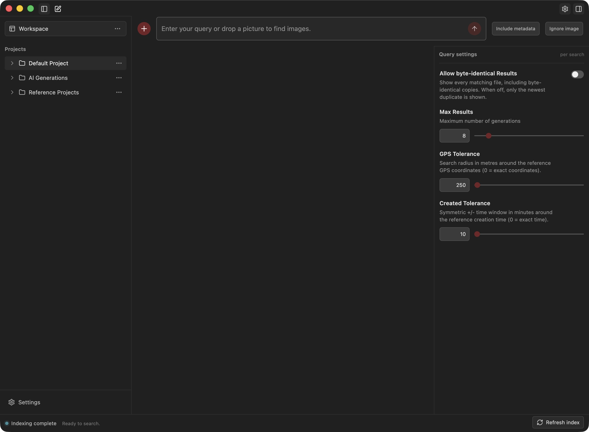

### Indexing

Indexing is started and stopped on demand.

- **Refresh index** — starts indexing.
- **Stop indexing** — stops indexing.

> 💡 Text metadata indexes in milliseconds; image embeddings take seconds per image depending on model size and GPU. Start small with a test folder before indexing large collections.

By default, `Use Previews for Image Retrieval` is `active` in General Settings. This setting increases embedding speed noticeably, but may affect retrieval precision.

## Behind the Scenes: Fusion Embedding

What makes Find Images.app different from a plain filename or prompt search is its use of **multimodal fusion embeddings**.

When an image is indexed, both its visual content (pixels) and its metadata (prompt, model, EXIF data) are combined into a single embedding vector — a point in a high-dimensional space. Similar images cluster together. When you search, your query (text, reference image, or both) becomes another point, and the app finds the nearest neighbors using cosine similarity.

This means:

- An image of a cat found by text description sits near other cat images, even if their prompts say nothing about cats
- A reference photo of a sunset ranks warm-toned landscapes first, regardless of how they were created
- Generation metadata and visual content reinforce each other when both are available

> **Score ≠ Quality. Score = Embedding Coverage.**
>
> A lower score does not necessarily mean worse results. Different search signals change what ranks first; structured filters determine which candidates are eligible at all.

<a id="use-cases"></a>

## Use Cases

The **Find Images.app** queries allow you to combine multiple criteria:

- an attached reference image or absolute image path; use it for "like this image", style references, or changes to a shown image
- text query: with an attached reference image, positively describe additions or changes; without an attached reference image, write a complete description. `Model:`, `LoRAs:`, `Size:`, `Source:`, `Origin:`, and `Timestamp:` are hard AND filters.
- `Include metadata`: add reference image generation metadata as a ranking signal across the full corpus, not an identical-metadata filter
- `Ignore image`: ignore reference image pixels; use only for prompt or metadata similarity without visual similarity

Use one, two, three, or all four criteria in each search, depending on what you want to find or achieve.

| Goal                                                          | Recommended Criteria                                                            | Why?                                                                                                                    |
| ------------------------------------------------------------- | ------------------------------------------------------------------------------- | ----------------------------------------------------------------------------------------------------------------------- |
| **"Find visually similar images"**                            | `reference image`                                                               | The reference image ranks the complete corpus by visual similarity.                                                     |
| **"Same style, but different subject or scene"**              | `reference image + text query`                                                  | Keep the reference as the visual anchor; positively describe the change, for example `people in front of a brick wall`. |
| **"More from this creative direction"**                       | `reference image + Include metadata`                                            | Image pixels and target metadata jointly rank the complete corpus by visual and generation-context similarity.          |
| **"Reference style plus a specific new concept"**             | `reference image + query + Include metadata`                                    | Combines visual reference, requested changes, and target metadata as ranking signals.                                   |
| **"Thematic search without a reference image"**               | `text query`                                                                    | Uses a complete descriptive text query across the full collection.                                                      |
| **"Require specific generation metadata"**                    | `query` with `Model:`, `LoRAs:`, `Size:`, `Source:`, `Origin:`, or `Timestamp:` | These hard AND filters limit candidates before retrieval and reranking.                                                 |
| **"Prompt or metadata similarity without visual similarity"** | `reference image + Include metadata + Ignore image`                             | Uses reference metadata as a text-based similarity signal while deliberately omitting image pixels.                     |

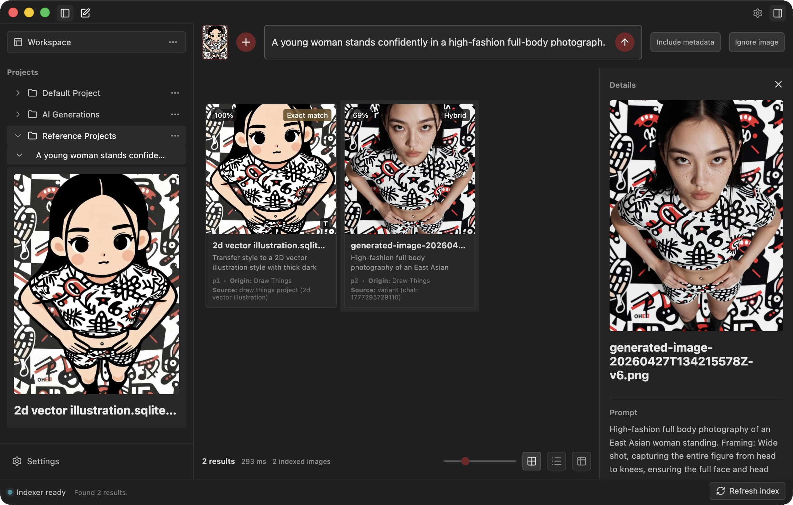

> This example shows how to formulate a query when you have a reference image but are looking for something that differs from it in specific ways — here: the same person, different style. The best approach is to clearly describe what your target image should look like. Visual similarity comes from the reference image itself. Restrictive phrasing such as "but" or "only" works less well than a clear, positively formulated description of exactly what you want to see in the end result.

The `Tags` section allows you to manage persistent tags for indexed images:

- You can list all existing tags by clicking into the `Add tag` field, add, or remove one or more tags for indexed images shown within the current query.
- Tags persist for indexed images until removed. They can be used with your query as a distinct filter to help you organize your image collection.

## Comparing App vs Plugin

| Feature                                   | Find Images.app | find-image (plugin) |
| ----------------------------------------- | --------------- | ------------------- |
| Multimodal visual search                  | ✅              | ✅                  |
| Text-based queries                        | ✅              | ✅                  |
| Metadata / EXIF filters                   | ✅              | ✅                  |
| Reference image search                    | ✅              | ✅                  |
| Tag management                            | ✅              | ✅                  |
| Project organization                      | ✅              | ✅                  |
| Standalone (no LM Studio)                 | ✅              | ❌                  |
| Continue with results in chat             | ❌              | ✅                  |
| analyse-image / process-image integration | ❌              | ✅                  |

**Use the plugin** if you want to find images and then immediately work with them in LM Studio — analyze, edit, generate variations.

**Use Find Images.app** if you want a dedicated search tool for browsing, organizing, and discovering images without any agent layer.

## Persistent Data

```
~/.find-images/data/generation_index_cache.json         # Generation metadata index
~/.find-images/data/multimodal_embeddings.sqlite3       # Multimodal embedding vectors
~/.find-images/.internal/global-plugin-configs.json     # General settings
```

These files survive app updates.

## Staying Up to Date

Download new releases from the [releases page](https://github.com/ceveyne/find-images-releases/releases). Your settings and embeddings persist across versions.

💡 Watch this repository on GitHub to get notified about updates. 👀

## License

Find Images.app is free to use for personal and commercial purposes. It is distributed as a compiled application (DMG bundle).

The underlying search engine, `find-image`, remains available as open source under the [MIT License](https://opensource.org/licenses/MIT). The integrated llama-server runtime engine is also included under its respective terms.
